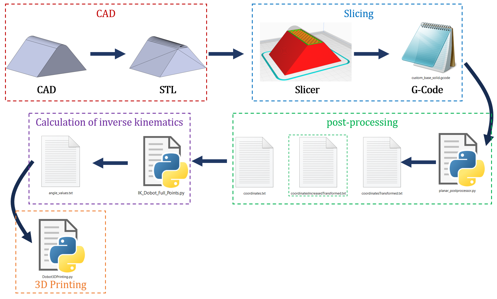

# 3D printing system on non-planar surfaces using a robotic arm

The Fused Deposition Modeling is a technique within Additive Manufacturing, in which a part is formed by stacking two-dimensional layers, using a technique known as 2.5 axis, with which there are certain defects such as the staircase effect, the decrease of resistance in the printing direction, the use of supports and limitations such as printing on flat surfaces. In order to reduce these limitations and defects, the design of a 3D printing system on non-planar surfaces using the Dobot Magician robotic arm, to which a 3D printing system is adapted and its degrees of freedom are increased. Additionally, the kinematics calculation is performed through the Denavit-Harterg parameters, and a 3D printing <a href="https://github.com/compas-dev/compas_slicer">slicer</a> for multi-axis machines is selected and configured. Finally, a comparison is made between the parts printed by non-planar printing and traditional printing, obtaining a decrease of the staircase effect and an error of 6.125% in the width of the compared part.
 

## Workflow for 3D printing on non-planar surfaces

In the workflow for flat surface printing, there are 5 fundamental processes: CAD, lamination, post-processing, calculation of inverse kinematics and 3D printing. In this sense, initially the digital model of the part or surface to be printed is made, using CAD software such as Solidworks, Blender or other, where the file is saved in STL format. Subsequently, the part is laminated in a traditional 3D printing software, such as Ultimaker Cura, from which a g-code is obtained, with the positions, speeds and extrusion material. After that, the post-processing is performed, in which the coordinates of the g-code must be abstracted and a set of operations must be performed in order to finally calculate the angles of the joints and send them to the robot to perform the 3D printing.

In the workflow for flat surface printing, there are 5 fundamental processes: CAD, lamination, post-processing, calculation of inverse kinematics and 3D printing. In this sense, initially the digital model of the part or surface to be printed is made, using CAD software such as Solidworks, Blender or other, where the file is saved in STL format. Subsequently, the part is laminated in a traditional 3D printing software, such as Ultimaker Cura, from which a g-code is obtained, with the positions, speeds and extrusion material. After that, the post-processing is performed, in which the coordinates of the g-code must be abstracted and a set of operations must be performed in order to finally calculate the angles of the joints and send them to the robot to perform the 3D printing.

