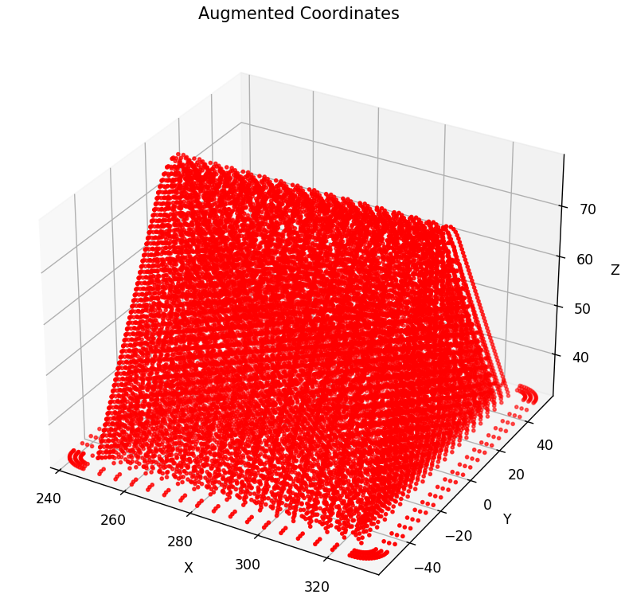
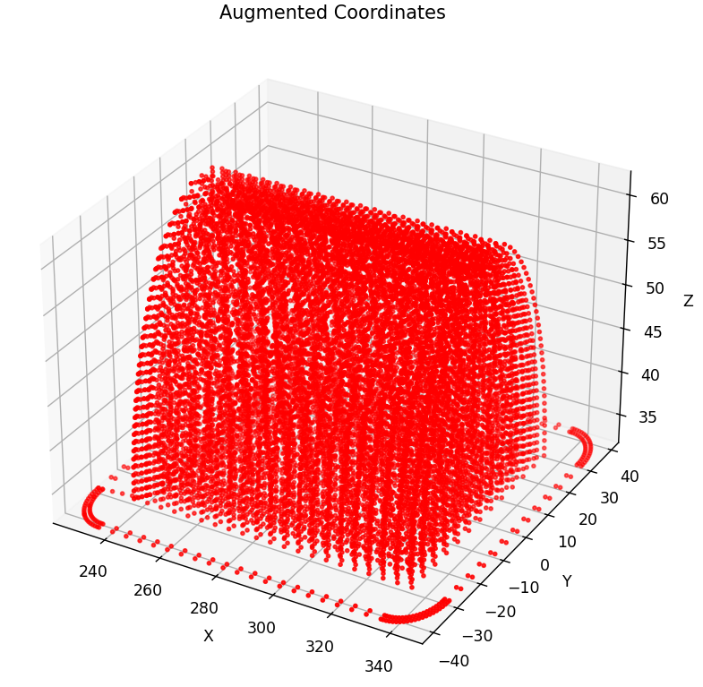

# DESCRIPTION OF FILES

<b>Data1</b> contains the pyramid used as the basis for the cube printout. The parameters used in Cura for the lamination were a layer height of 0.35 mm for the first layer and 0.9 mm for the rest of the layers, finally, a 20% infill was used.

<b>Data2</b> contains the half shaft used as the basis for the printing of the propeller blade. The parameters used in Cura for the lamination were a layer height of 0.35 mm for the first layer and 0.9 mm for the rest of the layers, lastly, a 20% infill was used..

